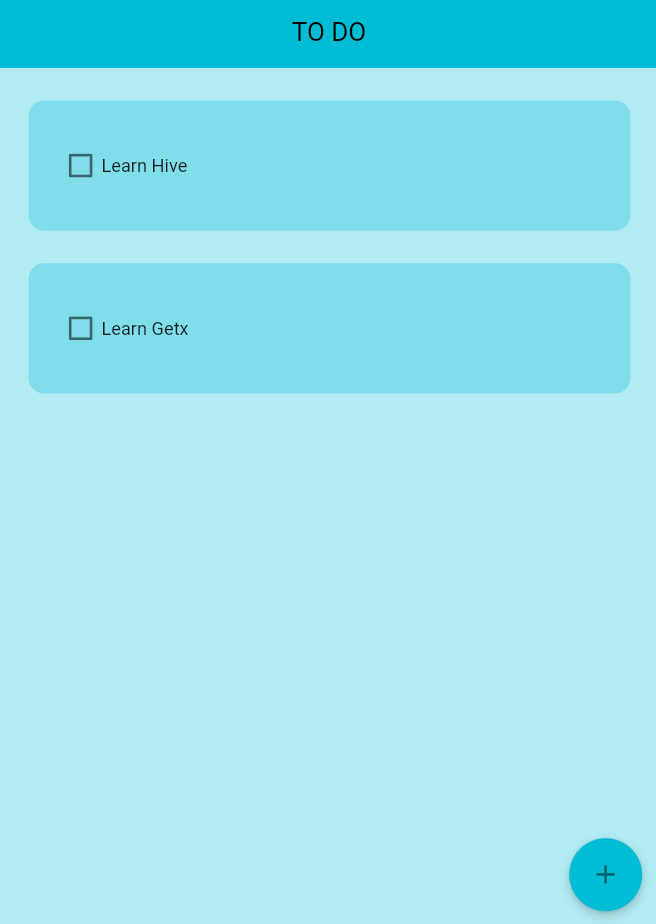
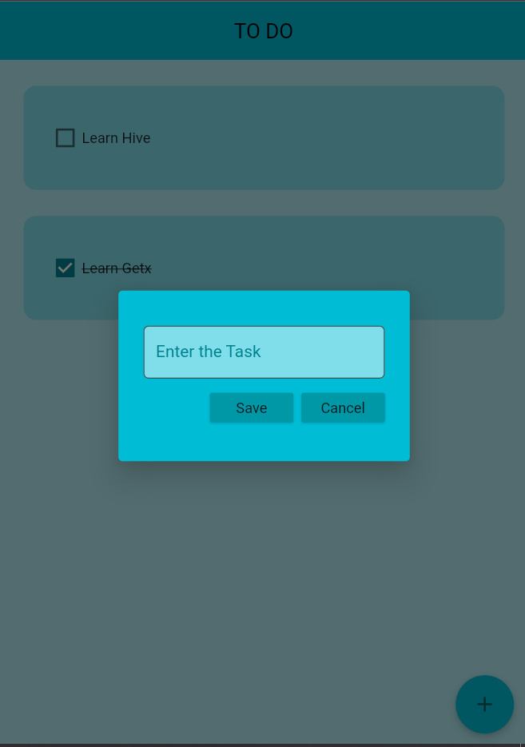
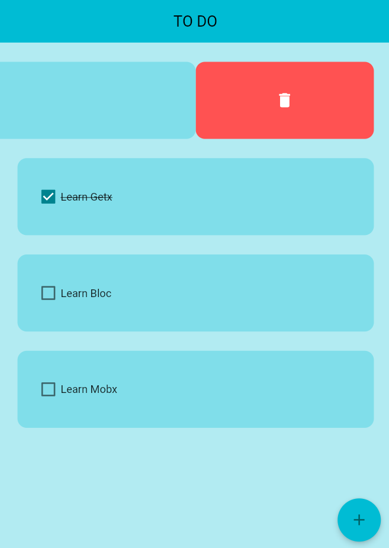

# todo_app_hive_getx

A new Flutter project. 

In this repository contains simple ToDo App made using Flutter.Statemanagement package Getx and Database as Hive.

## Screenshots

| Home Screen                          | Add task                            |
| ------------------------------------ | ----------------------------------- |
|  |  |
| Delete Task                          |
|    |

## Getting Started

This project is a starting point for a Flutter application.

A few resources to get you started if this is your first Flutter project:

-   [Lab: Write your first Flutter app](https://docs.flutter.dev/get-started/codelab)
-   [Cookbook: Useful Flutter samples](https://docs.flutter.dev/cookbook)

For help getting started with Flutter development, view the
[online documentation](https://docs.flutter.dev/), which offers tutorials,
samples, guidance on mobile development, and a full API reference.
